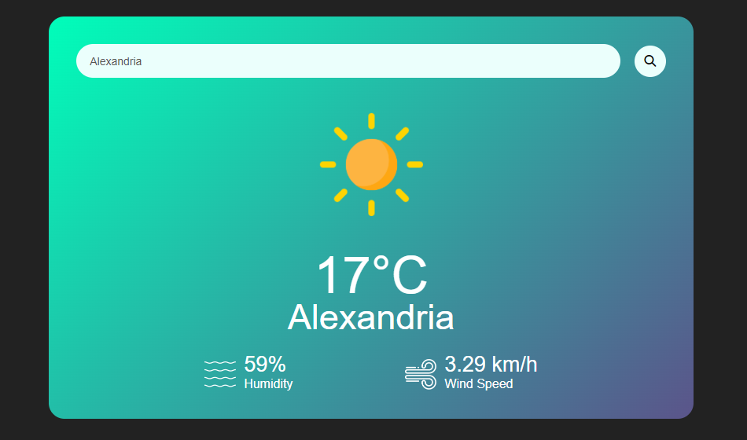

# Weather App

## Badges

Add badges from somewhere like: [shields.io](https://shields.io/)

## Description

The Weather App is a simple web application that allows users to check the current weather conditions of a location. It fetches data from the OpenWeather API and displays it in a user-friendly interface.

## Features

- Check the current weather conditions of any location.
- Responsive design ensures a seamless experience across devices.
- Uses the OpenWeather API to fetch weather data in real-time.
- Intuitive interface with clear and concise weather information.

## Technologies Used

- HTML5
- CSS3
- JavaScript
- OpenWeather API

## Setup

1. Clone the repository:
   git clone [https://github.com/yourusername/weather-app.git](https://github.com/elsa33eed/Weather-App.git)

2. Navigate to the project directory:
   cd weather-app
3. Open the `index.html` file in your web browser.

## Usage

- Enter the name of the city or location you want to check the weather for in the search bar.
- Press the "Search" button or hit Enter to fetch the weather data.
- View the current weather conditions including temperature, humidity, wind speed, etc.

## API Usage

This Weather App uses the OpenWeather API to fetch weather data. You will need to sign up for an API key at [OpenWeather](https://openweathermap.org/) and replace the placeholder in the `script.js` file with your API key.

const apiKey = 'YOUR_API_KEY_HERE';

## Credits

- Weather icons by [Flaticon](https://www.flaticon.com/).
- OpenWeather API for providing weather data.

## License

This project is licensed under the MIT License - see the [LICENSE](LICENSE) file for details.
